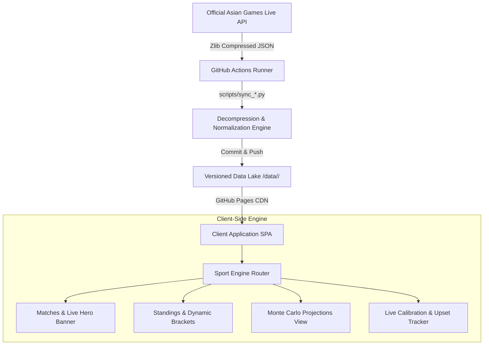
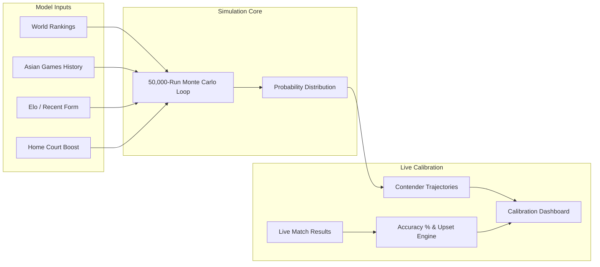

# 🏅 Asian Games 2026 — Analytics & Tracker Hub
### *Aichi-Nagoya 2026 • Real-Time Tournament Tracking, Monte Carlo Medal Projections & Live Calibration*

<p align="center">
  <a href="https://nj-1996.github.io/Asian-games-2026-predictions-/">
    
  </a>
</p>

<p align="center">
  
  
  
  
  
  
</p>

---

## 🌟 Overview

The **Asian Games 2026 Analytics & Tracker Hub** is a responsive, high-performance web platform and data pipeline built for tracking tournament matches, generating statistical Monte Carlo medal predictions, and calibrating live model accuracy throughout the **20th Asian Games (Aichi-Nagoya 2026)**.

The entire frontend runs client-side as a zero-dependency Single Page Application (SPA), fed by automated, serverless Python scrapers running on scheduled GitHub Actions workflows.

```
  ┌────────────────┐       ┌────────────────┐       ┌─────────────────┐       ┌──────────────────┐
  │  Asian Games   │ ───▶  │ GitHub Actions │ ───▶  │  Versioned JSON │ ───▶  │  Client Browser  │
  │  Official API  │       │ Scraper & Sync │       │   Data Store    │       │ Responsive SPA UI│
  └────────────────┘       └────────────────┘       └─────────────────┘       └──────────────────┘
     (Live Scores)            (Every 30 min)          (data/<sport>/)           (Dynamic Engines)
```

---

## 🏆 Supported Sports & Feature Matrix

| Sport | Categories | Standings / Group Stage | Knockout Bracket | Set Scores | Monte Carlo Predictions | Dual Bronze Support |
| :--- | :---: | :---: | :---: | :---: | :---: | :---: |
| 🏀 **Basketball** | Men · Women | FIBA (2-1-0 pts, Diff, Byes) | Full Knockout | Quarter-by-Quarter | 50,000 Runs (FIBA/Asia Cup + MoV) | ❌ Single (Bronze Playoff) |
| ⚽ **Football** | Men · Women | Points, GD, GF, Disciplinary | Knockout + ET/PKs | Half-time & Full-time | 50,000 Runs (FIFA/AFC ELO) | ❌ Single (Bronze Playoff) |
| 🏐 **Volleyball** | Men · Women | Sets Ratio, Points Ratio | Quarterfinals → Final | Set-by-Set (25-pt / 15-pt) | 50,000 Runs (FIVB Rankings) | ❌ Single (Bronze Playoff) |
| 🏑 **Hockey** | Men · Women | Pools, Goal Difference | Semifinals → Final | Quarter Scores + Shootouts | 50,000 Runs (FIH Rankings) | ❌ Single (Bronze Playoff) |
| 🎾 **Soft Tennis** | Men · Women · Mixed | Round Robin & Byes | 12-Team / QF Brackets | Game-by-Game (Best of 7/9) | 50,000 Runs (ISTF/ASTF/Anseong) | ✅ Dual Bronze (SF Losers) |
| 🏓 **Teqball** | Men · Women · Mixed | Group Phase Tables | Round of 16 → Final | Set Scores (12-pt Sets) | 50,000 Runs (FITEQ World Tour) | ✅ Dual Bronze (SF Losers) |
| 🎯 **Modern Pentathlon** | Men · Women | Riding, Fencing, Swim, Laser-Run | Direct Ranking / Points | Event Breakdown | 50,000 Runs (UIPM Cutoff Model) | ❌ Ranked Podium |
| 🏏 **Cricket** | Men · Women | Group Standings & NRR | Super 8s / Knockouts | Inning Scores & Overs | 50,000 Runs (ICC T20 Rankings) | ❌ Single (Bronze Playoff) |
| 🤾 **Handball** | Men · Women | Official IHF (2-1-0 Pts, GD) | QFs & SFs → Final | Half-time & Full-time | 50,000 Runs (IHF/Asian Champs) | ❌ Single (Bronze Playoff) |
| 🏊 **Swimming** | Men · Women · Mixed | 41 Medal Events (20 M, 20 W, 1 X) | Heats → Finals (10 Lanes) | Lane Times & Splits (50m+) | 50,000 Runs (World Aquatics) | ❌ Ranked Podium |

---

## 📊 Key Highlights & Architecture

### 1. 🔄 Automated Data & Sync Architecture
* **Serverless Pipeline**: GitHub Actions cron runs every 30 minutes, executing specialized Python scrapers that fetch, decompress (`zlib`), and normalize live tournament feeds into cleanly structured JSON schemas.
* **On-Demand Live Sync**: One-touch client button triggers GitHub's `workflow_dispatch` API with live polling, spinner animations, and toast feedback.
* **Zero 404 Bottlenecks**: Concurrent data fetching using `Promise.all` with robust fallbacks across sport datasets.



---

### 2. 🎲 Monte Carlo Prediction & Live Calibration Engine
* **50,000 Iterations**: Match outcomes simulated using logistic win-expectancy functions, Elo differences, historical Margin of Victory (MoV), and regional tournament weightings.
* **Home-Advantage Factor**: Calibrated boost (+3.8 points for Japan in basketball; sport-tuned equivalents across all events).
* **Live Accuracy Calibration**: Tracks favorite win rates across completed fixtures, dynamic contender trajectory markers (*On Track*, *Contested*, *At Risk*), and real-time upset detection.



---

### 3. 🎨 Rich Visual UI Components
* **Dynamic Next Match Hero**: Prominently highlights the next upcoming match with a real-time countdown timer.
* **Detailed Set-by-Set Scores**: Displays individual quarter/set/game scores alongside aggregate match scores for volleyball, teqball, and soft tennis.
* **Interactive Responsive Brackets**: Smooth horizontal scrolling, high-contrast seed badges, winner progression highlights, and automatic same-country final handling.
* **Automatic Medal Engine**: Calculates resolved medals in real-time (e.g., `8 of 8 medals decided`), properly managing single bronze playoffs vs. automatic dual bronzes for losing semifinalists.

---

## 📁 Repository Structure

```text
├── .github/workflows/
│   ├── tracker_cron.yml            # Background 30-min cron & manual workflow_dispatch
│   └── sample.yml                  # Sandbox workflow for raw API decoding
├── css/
│   └── style.css                   # Mobile-first responsive UI & dark-mode styling
├── data/
│   ├── api_sample.json             # Decoded raw API snapshot (debug reference)
│   ├── basketball/                 # Data feeds for Basketball (men / women / predictions)
│   ├── cricket/                    # Data feeds for Cricket
│   ├── football/                   # Data feeds for Football
│   ├── handball/                   # Data feeds for Handball
│   ├── hockey/                     # Data feeds for Hockey
│   ├── modern_pentathlon/          # Data feeds for Modern Pentathlon
│   ├── soft_tennis/                # Data feeds for Soft Tennis (men / women / mixed)
│   ├── teqball/                    # Data feeds for Teqball (men / women / mixed)
│   └── volleyball/                 # Data feeds for Volleyball
├── js/
│   ├── app.js                      # Core router, parallel asset loaders & state machine
│   ├── core.js                     # Medal analytics, date/timezone parsers & UI renderers
│   └── sports/                     # Per-sport custom tournament engines
│       ├── basketball.js           # FIBA standings & knockout engine
│       ├── cricket.js              # NRR tables & T20 match parsing
│       ├── football.js             # Football group tables & bracket
│       ├── handball.js             # Handball 2-1-0 standings & QF/SF brackets
│       ├── hockey.js               # FIH pool rules & bracket
│       ├── modern_pentathlon.js    # Multi-event cutoff model & points table
│       ├── soft_tennis.js          # Dual bronze resolver & 12-team bracket
│       ├── teqball.js              # 3-set scoring & dual bronze bracket
│       └── volleyball.js           # Set ratio / points ratio standings engine
├── scripts/
│   ├── sync_basketball.py          # Scraper & parser for Basketball
│   ├── sync_cricket.py             # Scraper & parser for Cricket
│   ├── sync_football.py            # Scraper & parser for Football
│   ├── sync_handball.py            # Scraper & parser for Handball
│   ├── sync_hockey.py              # Scraper & parser for Hockey
│   ├── sync_modern_pentathlon.py   # Scraper & parser for Modern Pentathlon
│   ├── sync_soft_tennis.py         # Scraper & parser for Soft Tennis
│   ├── sync_teqball.py             # Scraper & parser for Teqball
│   └── sync_volleyball.py          # Scraper & parser for Volleyball
├── index.html                      # Application shell with dynamic cache busting
└── README.md                       # Documentation & Architecture Guide
```

---

## 🚀 Running Locally

Because the dashboard uses modern ES modules and `fetch()` for data loading, serve the project root via any local HTTP server:

```bash
# Clone the repository
git clone https://github.com/nj-1996/Asian-games-2026-predictions-.git
cd Asian-games-2026-predictions-

# Start a local HTTP server
python -m http.server 8000
```
Open **[http://localhost:8000](http://localhost:8000)** in your browser.

### Manually Refresh Data
To test or execute any scraper locally (requires `requests`):
```bash
pip install requests
python scripts/sync_basketball.py
```

---

## 🛠️ Built With

* **Frontend**: Vanilla JavaScript (ES6+), CSS3 (Flexbox/Grid, Custom Properties, Glassmorphism).
* **Simulations & Scraping**: Python 3.10+, `requests`, `zlib`, Monte Carlo modeling.
* **CI/CD & Hosting**: GitHub Actions, GitHub Pages.

---

<p align="center">
  <sub>Built for the 2026 Asian Games (Aichi-Nagoya) • Maintained by <a href="https://github.com/nj-1996">@nj-1996</a></sub>
</p>
